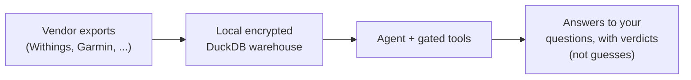

# Premura

Your phone tracks steps, but Health Connect drops most of what your
wearable actually measures: overnight heart-rate variability (HRV rMSSD),
stress, body battery, training load and readiness, VO₂ max. What survives
sits scattered across vendor export files that no two apps format the
same way, and you have no honest way to ask "did this actually change"
across sources.

Premura is a local-first warehouse plus a reasoning layer built for that
mess. It pulls your vendor exports into one place, keeps them encrypted
under your control (nothing uploads unless you ask), and answers
questions about your own data through tools that say "insufficient data"
rather than guess.

**Premura is not medical advice and not a diagnostic tool.** It helps you
organize and understand your own health data; it does not diagnose,
treat, or replace a clinician. Talk to a qualified healthcare
professional about any medical decision.



## How you run it

Clone this repo, then ask an AI coding agent to set it up and operate it
for you. You point it at your data exports and approve sensitive actions
(uploads, deletes) when it asks; it handles ingest, analysis, and
explanation through the tools below. You do not need the planning or
history docs to start — that path is this file plus
[AGENT_CLIENTS.md](docs/using/AGENT_CLIENTS.md) if your agent isn't
Claude Code.

> Docs live in [`docs/`](docs/): [Guide](docs/README.md) · [Doctrine](docs/shared/DOCTRINE.md) · [SPEC](docs/shared/SPEC.md) · [STATUS](docs/shared/STATUS.md) · [Changelog](docs/shared/CHANGELOG.md) · [Stages](docs/building/architecture/STAGES.md) · [Roadmap](docs/shared/ROADMAP.md) · [Full Plan](docs/building/product/FULL_APP_DEVELOPMENT_PLAN.md)

Premura is still pre-`v1`: release tags use the `v0.x.0` line until all
four stages form a coherent user-facing path. The `v0.1.0` tag marks the
first local-ingest pipeline foundation (it briefly carried the name
`v1.0.0`; retagged 2026-06-11 so the tag listing matches the real version
line).

## Quick start

Fresh clone? An agent (or human) in the repo runs **one setup command
first**:

```bash
uv run hpipe bootstrap                      # SETUP ONLY: prepare + verify this local checkout, report reload guidance
```

`uv run` is the entry point because `hpipe` is a console script that only
exists after the package is installed — `uv run` provisions the local
environment, then runs bootstrap, so it works on a brand-new clone (it
needs only `uv` on PATH; absence of `uv` is reported as a bounded
prerequisite, not a silent failure).

`uv run hpipe bootstrap` prepares/verifies the local checkout (environment
+ bundled skills), tells you whether an agent-session reload is needed,
and hands off the next safe step. It is setup-only — it never ingests
data, touches the warehouse, or uploads anything. Then operate normally:

```bash
bash ops/bootstrap.sh                       # one-time: brew installs, age keypair, optional rclone
uv run hpipe doctor                         # verify environment
# drop inputs into data/inbox/, then:
uv run hpipe run-monthly                    # ingest + encrypt (no auto-upload)
uv run hpipe upload --month YYYY-MM         # OPT-IN — push to Drive only when you say so
```

## age key storage

The `age` private key at `~/.config/premura/age.key` is the single
secret. Lose it = lose all encrypted backups. Two recommended options:

1. **Local backed-up file** (Time Machine, external drive). Default.
2. **Bitwarden secure note** — `bootstrap.sh` prints a `bw create item …`
   recipe you can run after `bw login`. Retrieve later with
   `bw get notes 'premura age key' > ~/.config/premura/age.key && chmod 600 …`.

## What's in the warehouse

`hp.fact_measurement` (point-in-time) and `hp.fact_interval` (bounded
events), joined to `hp.dim_metric` + `hp.dim_source`. See
[STATUS.md](docs/shared/STATUS.md) for live row counts and
[SPEC.md §5](docs/shared/SPEC.md) for the data contract.

Query directly:

```bash
duckdb -readonly data/duck/health.duckdb
```

## Surfaces

Point an agent at your data and let it operate Premura through tools —
that is the default path, not raw SQL:

- **`premura-mcp`** — the default, validity-gated agent surface. Every
  tool delegates to the deterministic signal engine (no raw `hp.*` SQL),
  and tools return structured `available` / `missing_input` /
  `stale_input` / `insufficient_data` verdicts instead of free-form
  claims. It includes the literature tools `pubmed_search` and
  `pubmed_fetch`: search hits are discovery candidates only, and final
  answers may cite only fetched PMID records.
- **`premura-mcp-operator --ack`** — a lower-guarantee expert fallback
  that adds a raw-SQL escape hatch. It refuses to start without explicit
  acknowledgement, so it is never the silent default.

For the full `hpipe` CLI reference and the complete MCP tool inventory,
see [OPERATIONS.md](docs/using/OPERATIONS.md). Direct DuckDB and notebook
access remain available as expert fallbacks.

Using an agent app other than Claude Code (OpenCode, Codex)? See
[AGENT_CLIENTS.md](docs/using/AGENT_CLIENTS.md) for the MCP config recipe
per client and what each one reads for skills.

## Pointers for your agent

When you hand Premura to an AI agent, point it at the right guide:

- **Operating Premura for you** (running tools on your data, no code
  edits) → [runtime-agent operating guide](docs/operating/RUNTIME_AGENT.md).
- **Changing Premura's code** in this clone → [`AGENTS.md`](AGENTS.md).
- **Opening a pull request** (human or agent) → development setup,
  checks, and the PR workflow live in [`CONTRIBUTING.md`](CONTRIBUTING.md).

## License

Apache License 2.0 — see [`LICENSE`](LICENSE).
